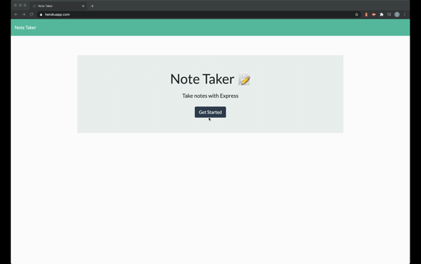

# Express Note Taker	

## DESCRIPTION

The note taker app allows the user to write, store, and delete notes through an intuitive interface. The data input by the user is stored in a JSON file and the backend is express. It is deployed on Heroku.

Technology used: Express, Node.js, JavaScript, HTML, CSS,  

Deployed application: https://shrouded-waters-78841.herokuapp.com/  

GitHub Repository: https://github.com/lauraaupert/Express-Note-Taker  

## TABLE OF CONTENTS

[User Story and Requirements](#USER)  
[Installation](#INSTALLATION)  
[License](#LICENSE)  

## USER STORY AND REQUIREMENTS 
AS A user, I want to be able to write and save notes\
I WANT to be able to delete notes I've written before\
SO THAT I can organize my thoughts and keep track of tasks I need to complete\

Application allows users to create and save notes.

Application allows users to view previously saved notes.

Application allows users to delete previously saved notes.

## INSTALLATION 

Please install NPM.

## QUESTIONS 
For additional questions, please get in touch:  
https://github.com/lauraaupert  
aupert.laura@gmail.com

## LICENSE
Apache License 2.0
Copyright 2021 lauraaupert

Licensed under the Apache License, Version 2.0 (the "License");
you may not use this file except in compliance with the License.
You may obtain a copy of the License at

http://www.apache.org/licenses/LICENSE-2.0

Unless required by applicable law or agreed to in writing, software
distributed under the License is distributed on an "AS IS" BASIS,
WITHOUT WARRANTIES OR CONDITIONS OF ANY KIND, either express or implied.
See the License for the specific language governing permissions and
limitations under the License.
